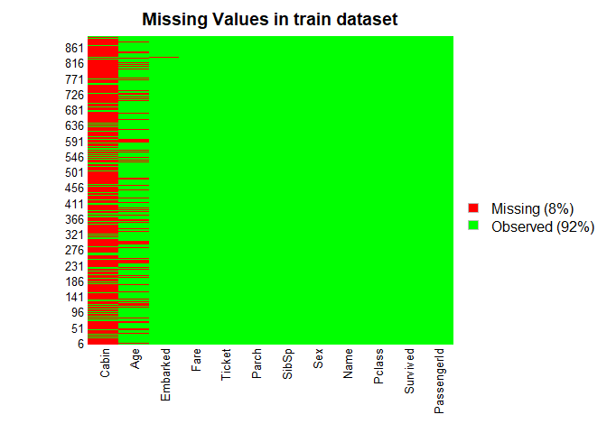
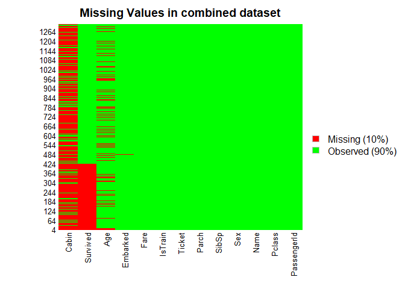

## Introduction

This is an attempt to onboard to 'Titanic: Machine Learning from Disaster' with R. This competition is widely considered as gateway to kaggle - One of the best places to learn, implement and test your data science knowledge on web.

Competition link: https://www.kaggle.com/c/titanic

However, this code is not meant to excel at the competition or get the best score. This might be a useful reference to someone who is absolute beginner to kaggle, to get a minimal understanding of "end-to-end" aspects in R. From my own experience, for a beginner a lots of details (eda, plotting, feature engineering, model tuning) could be bit overwhelming at the start. My approach only talks about bare minimal, so this is not a reference to "Best Approach". However, it could help anyone quickly develop their first model and understand basic concepts. The logical progression after this should be to bring small improvements by focusing on details. There are many notebooks on kaggle itself, which could be good reference to implement best practices.

Assumptions: 

1. User is familiar to R, at least the basic functions. 
2. Rstudio (or some other IDE) is installed and properly configured.
3. Data files are downloaded and saved in R working directory.

Github link for code: https://github.com/yashendu/kaggle_Titanic


## 1. Code for reading in the dataset and/or processing the data


```r
#Load important R libraries

library(ggplot2)       #For plotting, but we don't use it extensively in our code
library(knitr)         #For converting to HTML and publishing, most probably you won't need this
library(dplyr)         #Data manipulation
```

```
## 
## Attaching package: 'dplyr'
```

```
## The following objects are masked from 'package:stats':
## 
##     filter, lag
```

```
## The following objects are masked from 'package:base':
## 
##     intersect, setdiff, setequal, union
```

```r
library(randomForest)  #Random Forest functions
```

```
## randomForest 4.6-14
```

```
## Type rfNews() to see new features/changes/bug fixes.
```

```
## 
## Attaching package: 'randomForest'
```

```
## The following object is masked from 'package:dplyr':
## 
##     combine
```

```
## The following object is masked from 'package:ggplot2':
## 
##     margin
```

```r
#Setting Seed for reproducibility of results

set.seed(666)     #Good practice

#Check the current working directory

getwd()
```

```
## [1] "D:/R/kaggle/titanic/kaggle_Titanic"
```

```r
#Check files in working directory

dir()
```

```
##  [1] "baseSubmission.csv"                "baseSubmission_dtree.csv"         
##  [3] "input"                             "kaggle_Titanic.Rproj"             
##  [5] "README.md"                         "rpart_documentation.pdf"          
##  [7] "Test_classification_algo.R"        "Titanic_base.Rmd"                 
##  [9] "Titanic_base_improvements_1.html"  "Titanic_base_improvements_1.md"   
## [11] "Titanic_base_improvements_1.Rmd"   "Titanic_base_improvements_1_files"
```

```r
#Read the input data file

train <- read.csv2("input/train.csv", header = TRUE, sep = ",", na.strings = "", stringsAsFactors = FALSE)
test <- read.csv2("input/test.csv", header = TRUE, sep = ",", na.strings = "", stringsAsFactors = FALSE)


#Check the input data

head(train)
```

```
##   PassengerId Survived Pclass
## 1           1        0      3
## 2           2        1      1
## 3           3        1      3
## 4           4        1      1
## 5           5        0      3
## 6           6        0      3
##                                                  Name    Sex  Age SibSp Parch
## 1                             Braund, Mr. Owen Harris   male   22     1     0
## 2 Cumings, Mrs. John Bradley (Florence Briggs Thayer) female   38     1     0
## 3                              Heikkinen, Miss. Laina female   26     0     0
## 4        Futrelle, Mrs. Jacques Heath (Lily May Peel) female   35     1     0
## 5                            Allen, Mr. William Henry   male   35     0     0
## 6                                    Moran, Mr. James   male <NA>     0     0
##             Ticket    Fare Cabin Embarked
## 1        A/5 21171    7.25  <NA>        S
## 2         PC 17599 71.2833   C85        C
## 3 STON/O2. 3101282   7.925  <NA>        S
## 4           113803    53.1  C123        S
## 5           373450    8.05  <NA>        S
## 6           330877  8.4583  <NA>        Q
```

```r
head(test)
```

```
##   PassengerId Pclass                                         Name    Sex  Age
## 1         892      3                             Kelly, Mr. James   male 34.5
## 2         893      3             Wilkes, Mrs. James (Ellen Needs) female   47
## 3         894      2                    Myles, Mr. Thomas Francis   male   62
## 4         895      3                             Wirz, Mr. Albert   male   27
## 5         896      3 Hirvonen, Mrs. Alexander (Helga E Lindqvist) female   22
## 6         897      3                   Svensson, Mr. Johan Cervin   male   14
##   SibSp Parch  Ticket    Fare Cabin Embarked
## 1     0     0  330911  7.8292  <NA>        Q
## 2     1     0  363272       7  <NA>        S
## 3     0     0  240276  9.6875  <NA>        Q
## 4     0     0  315154  8.6625  <NA>        S
## 5     1     1 3101298 12.2875  <NA>        S
## 6     0     0    7538   9.225  <NA>        S
```

```r
summary(train)
```

```
##   PassengerId       Survived          Pclass          Name          
##  Min.   :  1.0   Min.   :0.0000   Min.   :1.000   Length:891        
##  1st Qu.:223.5   1st Qu.:0.0000   1st Qu.:2.000   Class :character  
##  Median :446.0   Median :0.0000   Median :3.000   Mode  :character  
##  Mean   :446.0   Mean   :0.3838   Mean   :2.309                     
##  3rd Qu.:668.5   3rd Qu.:1.0000   3rd Qu.:3.000                     
##  Max.   :891.0   Max.   :1.0000   Max.   :3.000                     
##      Sex                Age                SibSp           Parch       
##  Length:891         Length:891         Min.   :0.000   Min.   :0.0000  
##  Class :character   Class :character   1st Qu.:0.000   1st Qu.:0.0000  
##  Mode  :character   Mode  :character   Median :0.000   Median :0.0000  
##                                        Mean   :0.523   Mean   :0.3816  
##                                        3rd Qu.:1.000   3rd Qu.:0.0000  
##                                        Max.   :8.000   Max.   :6.0000  
##     Ticket              Fare              Cabin             Embarked        
##  Length:891         Length:891         Length:891         Length:891        
##  Class :character   Class :character   Class :character   Class :character  
##  Mode  :character   Mode  :character   Mode  :character   Mode  :character  
##                                                                             
##                                                                             
## 
```

```r
#Check missing values, NA's in data set

library(Amelia) #For missmap, I find it good visual to see missing values at overview level
```

```
## Loading required package: Rcpp
```

```
## ## 
## ## Amelia II: Multiple Imputation
## ## (Version 1.7.6, built: 2019-11-24)
## ## Copyright (C) 2005-2020 James Honaker, Gary King and Matthew Blackwell
## ## Refer to http://gking.harvard.edu/amelia/ for more information
## ##
```

```r
missmap(train, col=c("red", "green"), main = "Missing Values in train dataset")
```

<!-- -->

```r
missmap(test, col=c("red", "green"), main = "Missing Values in test dataset")
```

<!-- -->

```r
#Result: Missing values mostly in "Cabin" and "Age" columns, rest columns don't have any (or few) values missing
```


## 2. Merge train and test datasets


```r
#combine train and test data set

#create identifier column if we need to separate train and test data later, we'll add a column "IsTrain" with values (train=TRUE, test=FALSE) to both datasets

train$IsTrain <- TRUE
test$IsTrain <- FALSE


#head(train)
#head(test)

#Add "Survived" column to test and fill NA before merging test and train

test$Survived <- NA

# Merge train and test

merge <- rbind(train, test)
head(merge)
```

```
##   PassengerId Survived Pclass
## 1           1        0      3
## 2           2        1      1
## 3           3        1      3
## 4           4        1      1
## 5           5        0      3
## 6           6        0      3
##                                                  Name    Sex  Age SibSp Parch
## 1                             Braund, Mr. Owen Harris   male   22     1     0
## 2 Cumings, Mrs. John Bradley (Florence Briggs Thayer) female   38     1     0
## 3                              Heikkinen, Miss. Laina female   26     0     0
## 4        Futrelle, Mrs. Jacques Heath (Lily May Peel) female   35     1     0
## 5                            Allen, Mr. William Henry   male   35     0     0
## 6                                    Moran, Mr. James   male <NA>     0     0
##             Ticket    Fare Cabin Embarked IsTrain
## 1        A/5 21171    7.25  <NA>        S    TRUE
## 2         PC 17599 71.2833   C85        C    TRUE
## 3 STON/O2. 3101282   7.925  <NA>        S    TRUE
## 4           113803    53.1  C123        S    TRUE
## 5           373450    8.05  <NA>        S    TRUE
## 6           330877  8.4583  <NA>        Q    TRUE
```

```r
table(merge$IsTrain)
```

```
## 
## FALSE  TRUE 
##   418   891
```

## 3. Minimal data processing (Missing Value + Catagorical Var treatment)


```r
#Missing value overview in Merge dataset

missmap(merge, col=c("red", "green"), main = "Missing Values in combined dataset")
```

<!-- -->

```r
#Result: Missing values mostly in "Cabin" and "Age" columns, Survived column is not available for test records - Which is normal. For other columns also, we'll check if any missing values are there and treat them if possible

#Check missing values in all relevant columns (Exc. PassengerID, Survived, IsTrain)


table(is.na(merge$Age)) #263 missing values
```

```
## 
## FALSE  TRUE 
##  1046   263
```

```r
table(merge$Age)
```

```
## 
## 0.17 0.33 0.42 0.67 0.75 0.83 0.92    1   10   11 11.5   12   13   14 14.5   15 
##    1    1    1    1    3    3    2   10    4    4    1    3    5    8    2    6 
##   16   17   18 18.5   19    2   20 20.5   21   22 22.5   23 23.5   24 24.5   25 
##   19   20   39    3   29   12   23    1   41   43    1   26    1   47    1   34 
##   26 26.5   27   28 28.5   29    3   30 30.5   31   32 32.5   33   34 34.5   35 
##   30    1   30   32    3   30    7   40    2   23   24    4   21   16    2   23 
##   36 36.5   37   38 38.5   39    4   40 40.5   41   42   43   44   45 45.5   46 
##   31    2    9   14    1   20   10   18    3   11   18    9   10   21    2    6 
##   47   48   49    5   50   51   52   53   54   55 55.5   56   57   58   59    6 
##   14   14    9    5   15    8    6    4   10    8    1    4    5    6    3    6 
##   60 60.5   61   62   63   64   65   66   67    7   70 70.5   71   74   76    8 
##    7    1    5    5    4    5    3    1    1    4    2    1    2    1    1    6 
##   80    9 
##    1   10
```

```r
table(is.na(merge$Pclass)) #NO missing values, Identified as categorical variable
```

```
## 
## FALSE 
##  1309
```

```r
table(merge$Pclass) #1: 323 + 2: 277 + 3: 709 (Most Passengers are traveling in 3rd Class)
```

```
## 
##   1   2   3 
## 323 277 709
```

```r
table(is.na(merge$Name)) #NO missing values
```

```
## 
## FALSE 
##  1309
```

```r
table(is.na(merge$Sex)) #NO missing values, Identified as categorical variable
```

```
## 
## FALSE 
##  1309
```

```r
table(merge$Sex) #F: 466 + M: 843 (Two-third passengers are Male)
```

```
## 
## female   male 
##    466    843
```

```r
table(is.na(merge$SibSp)) #NO missing values
```

```
## 
## FALSE 
##  1309
```

```r
table(is.na(merge$Parch)) #NO missing values
```

```
## 
## FALSE 
##  1309
```

```r
table(is.na(merge$Ticket)) #NO missing values
```

```
## 
## FALSE 
##  1309
```

```r
table(is.na(merge$Fare)) #1 missing values
```

```
## 
## FALSE  TRUE 
##  1308     1
```

```r
table(is.na(merge$Cabin)) #1014 missing values
```

```
## 
## FALSE  TRUE 
##   295  1014
```

```r
table(is.na(merge$Embarked)) #2 missing values, Identified as categorical variable
```

```
## 
## FALSE  TRUE 
##  1307     2
```

```r
table(merge$Embarked) # C: 270 + Q: 123 + S: 914 + 2 NA (missing values)
```

```
## 
##   C   Q   S 
## 270 123 914
```

```r
# We need to treat Cabin, Age, fare and Embarked for missing values. For a simplistic approach, we can fill median values for Age and Fare. Also, we can take mode (most common) class for  Embarked. Cabin? It could be bit tricky, so we will not use this column for our prediction for now.
## We use 'median' not 'mean' as median is less sensitive to extreme values (Outliers) and we are not treating outliers here

merge[is.na(merge$Embarked), "Embarked"] <- 'S'  #Replace NA with mode (Most frequent) value

merge$Age <- as.numeric(as.character(merge$Age))   #convert Age to numeric if imported as chr
merge[is.na(merge$Age), "Age"] <- median(merge$Age, na.rm = TRUE) #Replace NA with median value


merge$Fare <- as.numeric(as.character(merge$Fare))   #convert Fare to numeric if imported as chr
merge[is.na(merge$Fare), "Fare"] <- median(merge$Fare, na.rm = TRUE) #Replace NA with median value

# We need to treat categorical columns too, Pclass, Sex and Embarked (as identified earlier)

merge$Pclass <- as.factor(merge$Pclass)
merge$Sex <- as.factor(merge$Sex)
merge$Embarked <- as.factor(merge$Embarked)

# Also  change the predictor var "Survived" as factor (0, 1)

merge$Survived <- as.factor(merge$Survived)

# Check Structure of dataset

str(merge)
```

```
## 'data.frame':	1309 obs. of  13 variables:
##  $ PassengerId: int  1 2 3 4 5 6 7 8 9 10 ...
##  $ Survived   : Factor w/ 2 levels "0","1": 1 2 2 2 1 1 1 1 2 2 ...
##  $ Pclass     : Factor w/ 3 levels "1","2","3": 3 1 3 1 3 3 1 3 3 2 ...
##  $ Name       : chr  "Braund, Mr. Owen Harris" "Cumings, Mrs. John Bradley (Florence Briggs Thayer)" "Heikkinen, Miss. Laina" "Futrelle, Mrs. Jacques Heath (Lily May Peel)" ...
##  $ Sex        : Factor w/ 2 levels "female","male": 2 1 1 1 2 2 2 2 1 1 ...
##  $ Age        : num  22 38 26 35 35 28 54 2 27 14 ...
##  $ SibSp      : int  1 1 0 1 0 0 0 3 0 1 ...
##  $ Parch      : int  0 0 0 0 0 0 0 1 2 0 ...
##  $ Ticket     : chr  "A/5 21171" "PC 17599" "STON/O2. 3101282" "113803" ...
##  $ Fare       : num  7.25 71.28 7.92 53.1 8.05 ...
##  $ Cabin      : chr  NA "C85" NA "C123" ...
##  $ Embarked   : Factor w/ 3 levels "C","Q","S": 3 1 3 3 3 2 3 3 3 1 ...
##  $ IsTrain    : logi  TRUE TRUE TRUE TRUE TRUE TRUE ...
```

```r
# Split back to Test, Train after cleaning

train <- merge[merge$IsTrain==TRUE,]
test <- merge[!merge$IsTrain==TRUE,]
```

## 4. Base model with Random Forest


```r
#explicitly select the columns for prediction and strore in formulae

form <- as.formula("Survived ~ Pclass + Sex + Age + SibSp + Parch + Fare + Embarked")

rf_model <- randomForest(formula = form, data = train, ntree = 500, mtry = 3, nodesize = 0.01 * nrow(train))


#Make Prediction on Test set

Survived <- predict(rf_model, newdata = test)

#Check Prediction

Survived
```

```
##  892  893  894  895  896  897  898  899  900  901  902  903  904  905  906  907 
##    0    0    0    0    0    0    0    0    1    0    0    0    1    0    1    1 
##  908  909  910  911  912  913  914  915  916  917  918  919  920  921  922  923 
##    0    0    0    0    0    1    1    0    1    0    1    0    1    0    0    0 
##  924  925  926  927  928  929  930  931  932  933  934  935  936  937  938  939 
##    1    0    1    0    0    0    0    1    0    1    0    1    1    0    0    0 
##  940  941  942  943  944  945  946  947  948  949  950  951  952  953  954  955 
##    1    1    0    0    1    1    0    0    0    0    0    1    0    0    0    1 
##  956  957  958  959  960  961  962  963  964  965  966  967  968  969  970  971 
##    1    1    1    0    0    1    1    0    0    0    1    0    0    1    0    1 
##  972  973  974  975  976  977  978  979  980  981  982  983  984  985  986  987 
##    1    0    0    0    0    0    1    0    1    1    0    0    1    0    0    0 
##  988  989  990  991  992  993  994  995  996  997  998  999 1000 1001 1002 1003 
##    1    0    0    0    1    0    0    0    1    0    0    0    0    0    0    1 
## 1004 1005 1006 1007 1008 1009 1010 1011 1012 1013 1014 1015 1016 1017 1018 1019 
##    1    1    1    0    0    1    0    1    1    0    1    0    0    1    0    1 
## 1020 1021 1022 1023 1024 1025 1026 1027 1028 1029 1030 1031 1032 1033 1034 1035 
##    0    0    0    0    0    0    0    0    0    0    0    0    0    1    0    0 
## 1036 1037 1038 1039 1040 1041 1042 1043 1044 1045 1046 1047 1048 1049 1050 1051 
##    1    0    0    0    1    0    1    0    0    1    0    0    1    1    1    1 
## 1052 1053 1054 1055 1056 1057 1058 1059 1060 1061 1062 1063 1064 1065 1066 1067 
##    1    1    1    0    0    0    0    0    1    0    0    0    0    0    0    1 
## 1068 1069 1070 1071 1072 1073 1074 1075 1076 1077 1078 1079 1080 1081 1082 1083 
##    1    0    1    1    0    0    1    0    1    0    1    0    0    0    0    0 
## 1084 1085 1086 1087 1088 1089 1090 1091 1092 1093 1094 1095 1096 1097 1098 1099 
##    1    0    1    0    1    1    0    0    1    1    0    1    0    0    0    0 
## 1100 1101 1102 1103 1104 1105 1106 1107 1108 1109 1110 1111 1112 1113 1114 1115 
##    1    0    0    0    0    1    0    0    1    0    1    0    1    0    1    0 
## 1116 1117 1118 1119 1120 1121 1122 1123 1124 1125 1126 1127 1128 1129 1130 1131 
##    1    1    0    1    0    0    0    1    0    0    1    0    0    0    1    1 
## 1132 1133 1134 1135 1136 1137 1138 1139 1140 1141 1142 1143 1144 1145 1146 1147 
##    1    1    0    0    0    0    1    0    1    0    1    0    0    0    0    0 
## 1148 1149 1150 1151 1152 1153 1154 1155 1156 1157 1158 1159 1160 1161 1162 1163 
##    0    0    1    0    0    0    1    1    0    0    0    0    0    0    0    0 
## 1164 1165 1166 1167 1168 1169 1170 1171 1172 1173 1174 1175 1176 1177 1178 1179 
##    1    1    0    1    0    0    0    0    0    1    1    0    1    0    0    0 
## 1180 1181 1182 1183 1184 1185 1186 1187 1188 1189 1190 1191 1192 1193 1194 1195 
##    0    0    0    0    0    0    0    0    1    0    0    0    0    0    0    0 
## 1196 1197 1198 1199 1200 1201 1202 1203 1204 1205 1206 1207 1208 1209 1210 1211 
##    1    1    0    1    0    0    0    0    0    0    1    1    0    0    0    0 
## 1212 1213 1214 1215 1216 1217 1218 1219 1220 1221 1222 1223 1224 1225 1226 1227 
##    0    0    0    1    1    0    1    0    0    0    1    0    0    1    0    0 
## 1228 1229 1230 1231 1232 1233 1234 1235 1236 1237 1238 1239 1240 1241 1242 1243 
##    0    0    0    0    0    0    0    1    0    1    0    0    0    1    1    0 
## 1244 1245 1246 1247 1248 1249 1250 1251 1252 1253 1254 1255 1256 1257 1258 1259 
##    0    0    1    0    1    0    0    1    0    1    1    0    1    0    0    0 
## 1260 1261 1262 1263 1264 1265 1266 1267 1268 1269 1270 1271 1272 1273 1274 1275 
##    1    0    0    1    0    0    1    1    0    0    0    0    0    0    0    1 
## 1276 1277 1278 1279 1280 1281 1282 1283 1284 1285 1286 1287 1288 1289 1290 1291 
##    0    1    0    0    0    0    0    1    0    0    0    1    0    1    0    0 
## 1292 1293 1294 1295 1296 1297 1298 1299 1300 1301 1302 1303 1304 1305 1306 1307 
##    1    0    1    0    0    0    0    0    1    1    1    1    0    0    1    0 
## 1308 1309 
##    0    0 
## Levels: 0 1
```

```r
#### Create output file

#save Id values from test data
PassengerId <- test$PassengerId

#Initiate output dataframe with IDs
df <- as.data.frame(PassengerId)

#Add column for prediction
df$Survived <- Survived

#Check Structure of output dataframe
str(df)
```

```
## 'data.frame':	418 obs. of  2 variables:
##  $ PassengerId: int  892 893 894 895 896 897 898 899 900 901 ...
##  $ Survived   : Factor w/ 2 levels "0","1": 1 1 1 1 1 1 1 1 2 1 ...
```

```r
#write submission file, it will be saved in your working directory

write.csv(df, file = "baseSubmission.csv", row.names = FALSE)
```


# Now you can upload the csv file to Kaggle and check your score. Score of this model was 0.77272 at the time of upload.

## Notes and references

Data Science community have set really high standards when it comes to knowledge sharing. I will mention (and shout thanks!) few references which were helpful to me and might be useful to you for further reading (in no particular order). I'm open for constructive feedback and questions through comments.

https://www.blopig.com/blog/2017/04/a-very-basic-introduction-to-random-forests-using-r/

https://www.rdocumentation.org/packages/randomForest/versions/4.6-14/topics/randomForest

https://towardsdatascience.com/random-forest-in-r-f66adf80ec9

https://www.youtube.com/watch?v=Zx2TguRHrJE&list=PL8eNk_zTBST83rnRPkypp_0MrjoXobLDF&index=3

https://www.geeksforgeeks.org/random-forest-approach-for-classification-in-r-programming/?ref=rp

